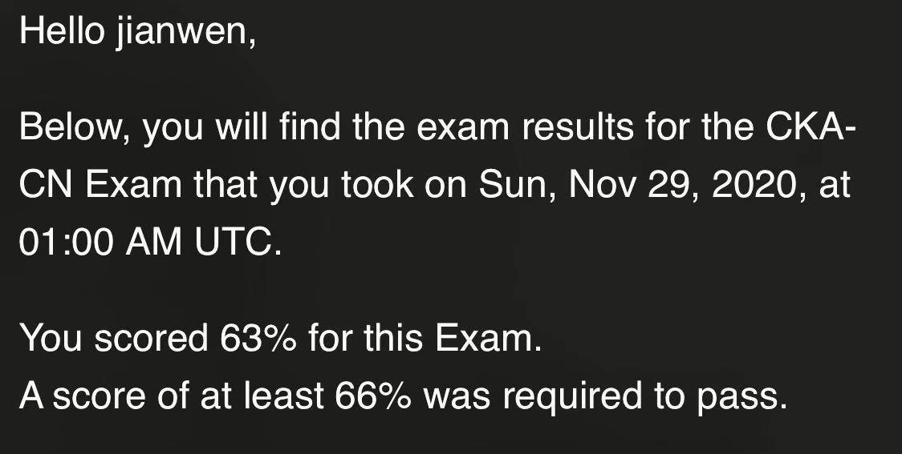

# 【生活】2020.11——个人总结

> 记录下自己的生活，反思下自己11月份的表现。

# 0. 序言

## 0.1 本文的目录

## 0.2 阅读本文可以给你带来什么

了解萝卜头11月份的表现，看看他的生活感悟。

# 1. 11月目标检查

11月份我的主要目标是通过CKA考试，不过没过差3分！没有完成任务！！！

**复盘一下**：

1. 没掌控好时间，以为考试时间是3小时，实际则是2小时，没有安排好做题时间
2. 由于时间比较赶，有些题目没仔细看
3. 有些知识点没准备好，比如k8s升级只会使用kubeadm升级，可是考试不是使用kubeadm安装，Network Policy不会创建...

预定了2021年1月10考的补考，这次真的要好好再准备一下啦，不能让这个钱给打水漂了，加油加油！这次一定要全力以赴！

# 2. 11月我做了什么

## 2.1 运动

**健身：** 12次

**跑步：** 5次，累计38公里

**篮球：**1次

**跳舞：**4次

> 践行精力管理课中老师说的每周运动300分钟！

## 2.2 学习

1. 非暴力沟通已经看完待总结分享
2. 怎样成为精力管理的高手
3. 亲密关系——10讲

## 2.3 生活

1. 现在的情绪状况是积极情绪大于消极情绪
2. 起床开始叠被子，房间弄得整洁有序，每周六日打算房间
3. 自律能力有提升
4. 自从看完非暴力沟通后自己在生活中也不断实践，认为自己的沟通能力提升了，更能懂得和他人交流
5. 跳舞后，认为自己的自信心增强了
6. 听完精力管理的课自己对自身精力管理更加了解，工作效率以及时间安排都有所提升

# 3. 12月目标

1. 通过科目四
2. 把cka最新真题做完

# 4. 总结

对自己的11月份做一个简单的总结，希望能不断提升自己，多多提高幸福感呀！加油！加油！奥利给！