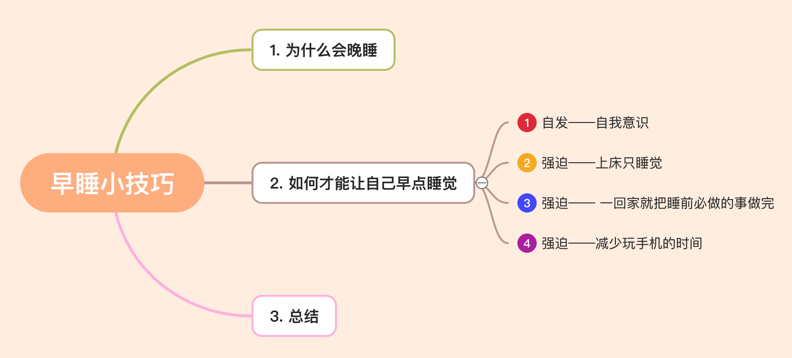

# 【生活】早睡小技巧

> 自己越来越认为感同身受的重要性！很多事情没有经历过，就很难去感受对方的情绪，甚至会对对方做出的一些想法或行为表示不解。其实好的沟通需要有好的共情能力！当人感受到自己被理解了，自己也会说的更多，更加去信任对方。
>
> 自己从以前1、2点睡觉到现在11:30到12点左右睡觉，分享下个人的生活小技巧。

# 1. 为什么会晚睡

我想大家对自己晚睡的原因还是比较清楚的，我猜大部分人是在**玩手机**！说实话这个年代不玩手机根本不可能，现在我们的吃穿住行都离不开手机。

# 2. 如何才能让自己早点睡觉

### 1. 自发——自我意识

需要自发想早点休息，发挥自我的**主动性**！就像有时候身体很累特别想睡觉，让你玩手机你也不想玩，就想上床睡觉。

### 2. 强迫——上床只睡觉

培养上床只睡觉的意识，我想很多人都喜欢在床上玩手机，包括我自己。大家需要培养这样的意识: 床只用来睡觉的，如果想玩不想睡觉，那么就起床去玩。**不要在床上玩手机！！！** 这个是我在怎样成为精力管理的高手课里面学习到的，感觉很有用，但是很难做到，我自己有时候也会忍不住玩，真的很难！

### 3. 强迫—— 一回家就把睡前必做的事做完

我睡觉前必须洗个澡、刷牙、洗脸、涂护肤膏，回去早还得 keep 健个身，算一算得花一个小时。要是我一回家就玩手机，逛一逛 b站，虎扑，就很容易搞到很晚，然后再去洗漱，基本是要过11:30了。所以一回家就把睡前该做的事情做完，剩余的空闲时间就可以允许自己任意支配，这样娱乐到11点多生物钟上头时，就可以立马睡觉了。

### 4. 强迫——减少玩手机的时间

那如何减少玩手机的时间？或这样问怎样把自己的时间和精力放在有用的地方上？

> 大家可以先看下何同学做的视频: [【何同学】这视频能让你戒手机](https://www.bilibili.com/video/BV1ev411x7en)
>
> 我个人还是蛮喜欢 b 站，里面有很多很有才华的 up 主，可以学习很多东西，拓展自我认知，力荐！！！

1. 通过手机软件设置自己每天使用手机的时间

2. 每次使用手机的三个问题？

#3. 总结

简单的分享个人的早睡小技巧，睡得晚的主要原因还是**玩手机**！有些东西还是得发自内心的想改才能改掉。希望大家多与我沟通交流，相互学习！成为更好的自己！