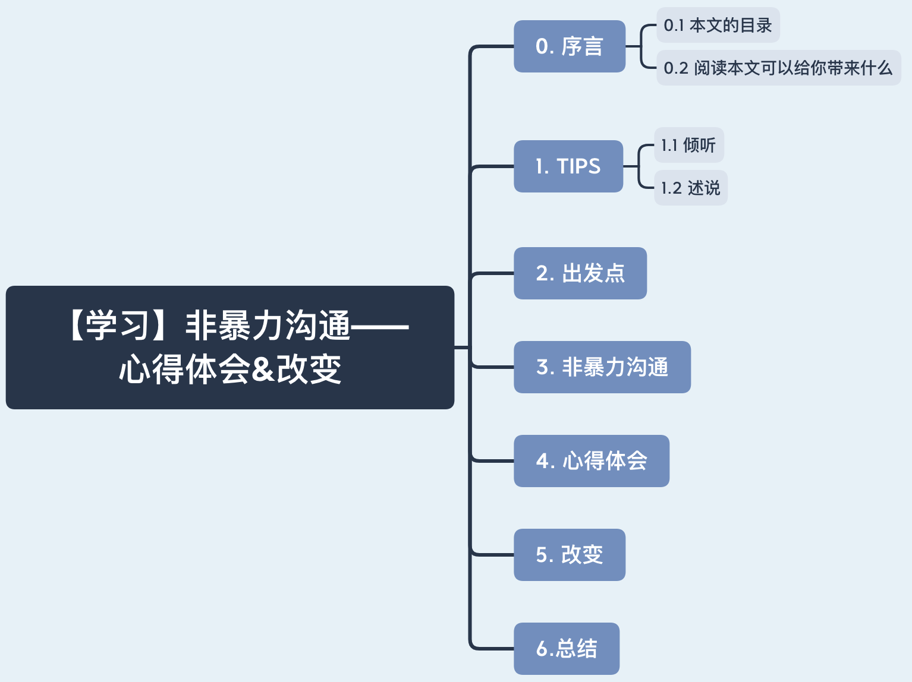

# 【学习】非暴力沟通——心得体会&改变

> 首先还是先感谢下王兄，我在几个月前曾向王兄讨教有没有提高沟通能力的学习材料，他力荐这非暴力沟通本书。每当读完一章的时候，我会去复盘我之前所做的一些事，发现之前很多事情处理得不妥当。向曾经被我伤害过的人说一声对不起！下面我将谈谈自己在学习完非暴力沟通后的心得体会以及自己的一些改变。

# 0. 序言

## 0.1 本文的目录

## 0.2 阅读本文可以给你带来什么

了解萝卜头在阅读完非暴力沟通后的心得体会&改变，顺便看看他给的TIPS。

# 1. TIPS

## 1.1 倾听

> 用心倾听对方的感受和需要，只有充分体会到对方的状况，才能进行更好地沟通。			

1. 当面对面进行交流时，眼神交流和适当的表情应答。
2. 可以在对方说完一段话的时候说下嗯，表明自己在认真的听。在语音聊天中，对方不知道你在干啥，所以及时回复嗯，间接告诉他我在听呢，你继续讲。
3. 在倾听时，如果认为自己在某方面没有特别理解时，其实可以打断一下讲述者。”不好意思，能不能打断您一下，对于你刚才说的xxx，我认为自己好像没理解到位，是xxx这样的意思吗？建议使用疑问句来给予讲述者反馈。——如果我是讲述者，我还是非常希望人家能主动积极打断我，首先我能确定他是在认真听我讲述，其次倾听者在提醒我，我一些地方可能没有讲清楚，他们也许期待我说得更加具体些。
4. 在倾听他人时，需要先放下已有的想法和判断，全心全意地体会对方，体会他的感受和需要。
5. 怎样判断对方的感受是否已经充分表达呢？不妨可以问一句：“你还有什么话要告诉我吗？”

## 1.2 述说

诚实的表达自己，不批评、指责——沟通模式：观察、感受、需要、请求

# 2. 出发点

就是单纯想提高自身的沟通能力，去了解学习一些沟通方式。与别人交流时，能更好的get到她们的点，当表述自己的想法时最好能到达她们内心的期望。怎么样才能让彼此双方沟通的更加快乐，更加愿意聊下去？

# 3. 非暴力沟通

## 3.1 四个要素

1.观察 2. 感受 3.需要 4.请求

> 举个栗子：
>
> 我和室友养了一只猫，它叫💩皇（Queen of shit），它特能拉粑粑。有一次我发现它竟然跳到马桶里面喝水，我顿时炸裂啦！！！工作日我们基本不在家，厕所门没关的话，那它之前不出意外也喝过，那我晚上回家还撸它，我裂开了呀！
>
> **观察**：我目睹猫进马桶喝水。
>
> **感受：** 我感到好恶心，我那时候让它趴着我腿上撸它，不能想了，我顶不住了。
>
> **需要：** 自己还是比较注重卫生，其次认为马桶里的水太不干净了，猫喝了对她身体不好。
>
> **请求：** 我的请求就是希望猫不要喝马桶里面的水。不过对它说了好几遍都不听的，我和室友在帮它洗澡时对它说：“你跳一次，咱们就洗一次！”后来大家也自觉了上完厕所，及时把盖子盖上，走后把门给关实。

## 3.2 观察

观察是非暴力沟通的第一个要素。观察到发生的事情，并清楚地说出观察结果。千万不要带有评论，若是带有评论，别人会倾向于听到批评，可能会反驳我们。

> 说实话我一直对我们大厅、厕所的卫生不是特别满意，虽然每个星期打扫一次，还是容易乱。自己也是垃圾制造者，但是我个人认为自己还是蛮勤快的。之前我看到课桌上有放有吃完没扔掉的果皮等垃圾，不经意会说是谁呀？这么懒，吃完东西都不扔掉！而我现在会说：”桌子上有不少垃圾，我认为维持一个干净的大厅会对大家的生活更好，咱们以后吃完的东西垃圾及时丢到垃圾桶里，每周定期打扫卫生一下。
>
> 换位思考：因为和发小、室友都比较熟悉，就像对待家人一样，对他们要求比较高，对他们说的一些话以及态度有时候真的蛮伤他们的，其实本意是好的！

## 3.3 感受

非暴力沟通的第二个要素是感受。需要勇敢表达自己内心真正的感受。

1. 在表达自己的感受时，最好不要使用觉得，觉得会让别人认为你表达的是看法或想法而非自身感受。
2. 可以通过建立表达感受的词汇表（兴奋、感动、开心、难受、害怕、担心、焦虑等），可以更清楚地表达感受，从而使沟通更为顺畅。

> 今年上半年真的比较忙，自己把最高优先权给了工作，其实有时候自己真的有一些事也没和领导说，不过现在会说啦，会积极表达自己内心的感受！

## 3.4 需要

非暴力沟通的第三个要素是需要，我们为什么感到高兴或难受，是因为一些事满足或没有达到我们内心的需要。

1. 大多数人并不习惯从需要的角度来考虑问题，在不顺心时，我们倾向于考虑别人有什么错。就比如之前我看到大厅课桌上有垃圾，会暗指不扔垃圾的人懒。
2. 社会文化并不鼓励我们表达个人需求。实际上，如果直接说出需求，获取积极回应的可能性就会增加。

> 怎么说呢？嗯... 就像有些人说话比较直率，有些人则比较委婉，两种方式其实各有好处，但是我现在认为一些重要的事还是直接说出来比较好，这样对方也能get到。

## 3.5 请求

请求是非暴力沟通的第四个要素，其实也就是我们请求别人帮助，希望对方做一些事。但是以什么样的方式提出请求容易得到积极回应呢？

1. 明确自己想要什么，然后提出具体请求，越具体越好。
2. 当对方对我们提出的请求给予反馈时，需要表达下我们的感激；若对方不愿反馈，倾听他的感受和需要。
3. 我们应当提出请求而非命令，因为命令让人对方感到是在强迫他们，那么他们也不太想满足我们的愿望。

> 请求和命令的区别？如果请求没有得到满足，提出请求的人如果批评或指责，那就是命令。举个栗子，妈妈看到儿子房间很乱，很脏，妈妈这样说：“你今天必须把房间打扫干净。这个是命令式的，让人听起来不舒服。请求式：儿子，妈妈希望你能把房间打扫干净一点，这样你自己住的也舒服，你好了，妈妈也开心。

# 4. 心得体会

1. 聊天还是有技巧的，认为之前自己情商是真的低，多学习，多与人交流，情商还是能慢慢提高！
2. 当感到愤怒的时候，千万不要做脑中的暴力想法，当你骂别人指责别人后还是解决不了问题，你感到愤怒一定是因为一件或一些事没有达到你内心的需求，直接说出我们的需求有可能能把事情解决。
3. 用心去了解自己内心真正的需要，发现自己心底深处的愿望，并采取积极的行动，热爱生活、享受生活！
4. 坦诚相待，积极去表达感激之情。

# 5. 改变

> 纸上得来终觉浅,绝知此事要躬行。前段时间和我师傅以及姐夫交流到自己看完非暴力沟通后自己的学习到的一些东西，以及自己的一些改变。但是自己认为还是描述的不清晰，他们给我的意见是再多多实践，感悟！自己后面也会多实践总结，不断提升自己。非常感谢！

我自己谈谈个人的改变：

1. 我之前是一个比较内向的人，比较害怕在陌生的环境，也不太擅长表达个人的感受，自己的沟通能力不太行。不过现在很愿意尝试一些新鲜的东西，尝试一些之前没做过的事，也会更加主动和陌生人沟通，自己也愿意去分享一些东西。
2. 当心情不好想生气，对待亲人那种很“倔”的脾气（我妈可能比较清楚）我保证不会再犯了，我现在认为自己很难很难再生气、发怒了。
3. 在看书学习的时候，自己会去复盘之前的行为，发现自己有很多做的不好的地方。举几个栗子：1. 我在打扫卫生的时候，猫咪捣乱，我之前会打它屁屁，现在我会把它放到笼子里面，等我打扫干净再放出来，因为打它解决不了问题；2. 先陈述下没有其他意思，单纯只是认为之前做的不好。当时她租房的时候，交了定金感觉租得不好，向我求安慰的时候。我上来直接说一句傻白甜，说她租房也不咨询下我的意见。现在肯定不能这么说，因为她是来求安慰的，不能再责怪她了，应该说没事没事，都过去的事情了，损失我来承担，下次以后租房一起看下，现在咱们看看怎么做如何才能使损失最小化。还有一些事情也就不想再阐述，真的没别的意思，只是单纯认为自己做的不好，不过现在通过看书学习复盘实践，认为自己已经升级啦！向前看！未来更美好！
4. 整个人变得蛮积极向上的，去享受生活，现在要是有双休会抽出一天出去走走看看，好好体验生活，不想宅在家里。
5. ...

# 6. 总结

本文简单阐述萝卜头在看完非暴力沟通后的心得体会以及他自身的改变。

