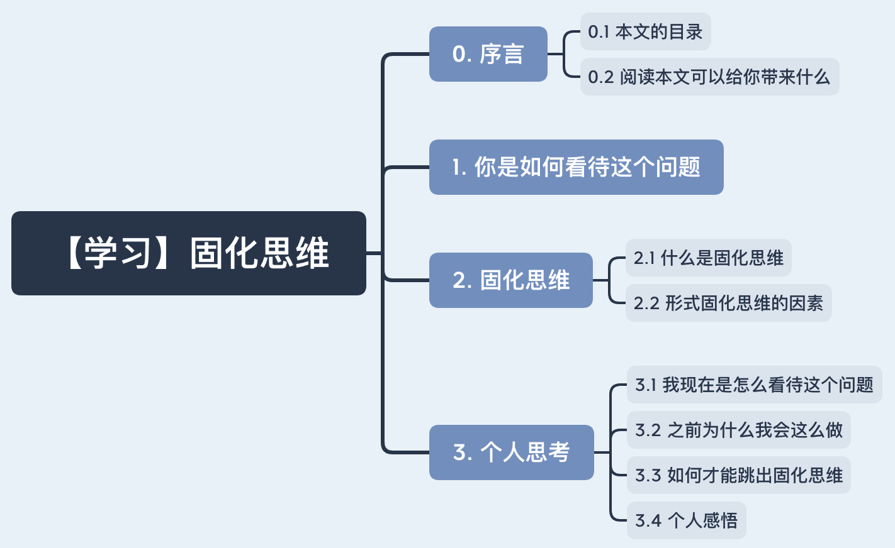

# 【学习】固化思维

> **背景：** 上周末本科朋友来杭州看我，我向她们请教了几个问题。其中的一个问题是如何去了解女生的思维方式？我说我最近有在看情感相关的书籍，但是在看完书后，认为书中讲的一些东西还是过于理论，一些例子也不够贴近生活。她们给我的意见是：下载个抖音，好好看看！

# 0. 序言

## 0.1 本文的目录

## 0.2 阅读本文可以给你带来什么

了解萝卜头对固化思维这个问题的思考。

# 1. 你是如何看待这个问题

> 没别的意思，我就想用个发生在自己身上的例子来更好的引出这个话题。

AB是一对情侣，小A的最近一段时间情绪状态不是很好，小A不想把自己的负面情绪带给她，表达了自己的状态不是很好，不愿与小B分享。而小B想替小A分担下不好的情绪，小B心里想小A的这种行为太伤人了，没有把她当家人看待！

你是如何看待这个问题 ？其实从各自的出发点看，都是为了对方好。

# 2. 固化思维

## 2.1 什么是固化思维

**百度：**固化思维就是按照积累的思维活动经验教训和已有的思维规律，在反复使用中所形成的比较稳定的、定型化了的思维路线。

**个人：** 用固定的模式或思路去解决问题。

## 2.2 形成固化思维的因素

1. **不久前发生的感知经验。**比如，一个0，如果它的后面都是数字，你就会毫不犹豫的认为它是数字；如果它后面是一组英文字母，那你也会觉得它就是字母O。
2. **长期形成的习惯或意识**。人们在认知人或事时，总是根据自己以往的经验、知识、认识来判断，而在主观上有一定的定型。也许是从小养成的习惯思维，也许是职业工作所形成的思维定势。不可否认，过去的经验有的使得我们的思维发展，也有的阻碍了我们思维的扩散。
3. **思维成熟度，因人而异**。不同个体，因为年龄，心智，所受教育和经历都不一样，对待同一个问题会有不同的思维方式，会有不同的感受，做出不一样的行为反应。

# 3. 个人思考

## 3.1 我现在是怎么看待这个问题

我个人认为小A的处理方式欠妥当，如果不好的事被自己在乎的人发现了，如果人家想帮你分担，还是说出来吧！毕竟倾述是一种情绪的释放方式。

## 3.2 之前为什么我会这么做

上文讲到形成固化思维的因素，其中有一点是长期形成的习惯或意识。我认为主要原因还是家庭影响——父母的行为表现吧！我认为我父亲是采用的是放养型教学模式，说实话我都没我爸手机号码，因为从我有手机到现在，我都不记得有没有和我爸打过电话，感觉只有回家了父亲才会说我几句，事情做错了也会说我几句，从小学到高中期间，责骂远远多于奖励。我认为我还是比较随我母亲，我印象比较深的就是母亲开店，无论昨天晚上干啥了，都会很准时的开门，我个人认为自己的执行能力很强，大概率是随了母亲。母亲生病了会和我姐说，我姐再会和我说，她说：“老妈怕你工作辛苦，不想影响你，就没和你说。”所以自己有些事情也不会和家人说，一是怕他们担心；二是有些事情说了他们可能也帮不了我，我爸可能还会骂我。自己也就渐渐养成这个处事思维，不想把自己的不好状态带给自己比较在意的人。

## 3.3  如何才能跳出固化思维

我上网查阅了一些资料，个人认为多采取换位思考、换角度思考的方式去处理日常中遇到的问题。总而言之，就是要**多思考，勤于思考，多反思，学习，训练**。

## 3.4 个人感悟

最近自己会在空闲时间刷刷抖音，之前对抖音的印象就是不太好，很多套路，容易上瘾...现在认为之前自己观念还是有问题的，只看到了不好的地方，没有看到抖音好的地方。

1、摄影技术，我发现抖音上面的一些摄影技术还是很实用；

2、情感——贴近生活的例子，情感的书有点过于理论，先不说抖音上面处理模式好不好，但是我认为当一件事情发生了，可以在抖音上面看到对方比较真实的感受是这么样的，对方的期望或想法是什么？当你了解了对方的感受以及她想要的东西，沟通或做事上面会采用更加合适的方案。

3、不过抖音还是容易上瘾，需要给它设置一个使用时间。